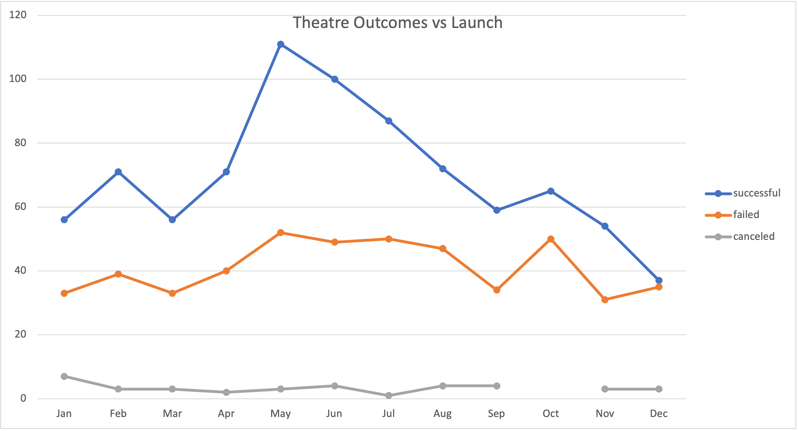

# Kickstarting with Excel

## Overview of Project
Understanding the viability of launching a specific type of Kickstarter (a play) based on their launch dates and goal of funding. 

### Purpose
To use the capabilities of excel to analyze the data set to make a conclusion on when the best time to launch a play would be, as well as a good goal to set for the amount of funding to receive. 

## Analysis and Challenges
In order to analyze the viability I chose to focus on two aspects that would lead to a successful launch; when the play is launched, and what the goal amount of funding is. 

### Analysis of Outcomes Based on Launch Date
In order to see if there is a prime time to launch the kickstarter for funding I sorted the years of data I had based on month that the kickstarter was initially introduced. When sorting the data into categories based on the outcome I was able to see a strong correlation between the campaign being launched in the spring time and the possibility it would be a successful launch. As we can see in the graph below, there is a spike of successful launches in May and it remains high in June. This is particularly significant as the amount of failed and canceled launches remain fairly constant over the course of the year. 

### Analysis of Outcomes Based on Goals

### Challenges and Difficulties Encountered

## Results

- What are two conclusions you can draw about the Outcomes based on Launch Date?

- What can you conclude about the Outcomes based on Goals?

- What are some limitations of this dataset?

- What are some other possible tables and/or graphs that we could create?
