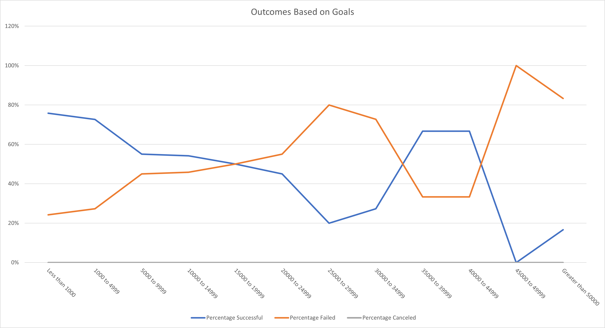

# Kickstarting with Excel

## Overview of Project
Understanding the viability of launching a specific type of Kickstarter (a play) based on their launch dates and goal of funding. 

### Purpose
To use the capabilities of excel to analyze the data set to make a conclusion on when the best time to launch a play would be, as well as a good goal to set for the amount of funding to receive. 

## Analysis and Challenges
In order to analyze the viability I chose to focus on two aspects that would lead to a successful launch; when the play is launched, and what the goal amount of funding is. 

### Analysis of Outcomes Based on Launch Date
In order to see if there is a prime time to launch the kickstarter for funding I sorted the years of data I had based on month that the kickstarter was initially introduced. When sorting the data into categories based on the outcome I was able to see a strong correlation between the campaign being launched in the spring time and the possibility it would be a successful launch. 

### Analysis of Outcomes Based on Goals
In order to analyze the relationship between the goal amount and the possibility that the play is going to be funded, I decided to create a graph of the the outcome percentage based on the goal amount. Rather than keeping x-axis as dollars, due to the nature of the data being spread apart and the goal amount largely arbitrary when considering single dollar differences. This led me to creating buckets of launches of 5000 dollars. This allowed me to recognize general trends of what the likelihood would be around a certain value.

### Challenges and Difficulties Encountered
Some challenges encountered were based on being able to take the data given and transform it to be usable. This was especially seen in the conversion of the timestamp from linux standard to something more readable. 

## Results
#### What are two conclusions you can draw about the Outcomes based on Launch Date?

As we can see in the graph above under Analysis of Outcomes Based on Launch Date, there is a spike of successful launches in May and it remains high in June. This is particularly significant as the amount of failed and canceled launches remain fairly constant over the course of the year. There are minor spikes during the course of the year, but none as large or significant as the spike during the middle of the year.

#### What can you conclude about the Outcomes based on Goals?

Based on the graph above under Analysis of Outcomes Based on Goals, there seemingly is not a correlation between these factors. Keeping in mind this is only a graph of the percentages in each bucket, we need to look at the numbers further. If we look at the count of the data we calculated in the file [Kickstarter Challenge](Kickstarter_Challenge.xlxs) under the Outcomes Based on Goals Sheet we can see that the number of launches requiring a higher goal is greatly reduced, almost by a factor of ten, allowing us to question if the percentages we are seeing at the higher end are significant enough to take into account for our analysis. The bulk of the data is grouped in the lowest 3 buckets, and in these there is over a 50% chance that the kickstarter will be funded successfully.

#### What are some limitations of this dataset?

The main limitations of the dataset lie in the amount of entries we have. Having more entries in each category would allow us to be able to come to a more confident conclusion.

#### What are some other possible tables and/or graphs that we could create?

Some additional graphs that would be useful would be a box and whisker plot showing the range of goals, so we could eliminate the outliers and redo the outcomes based on goals graph with different buckets to decrease the granularity of using the larger buckets that help the more spread out dataset fit. 

